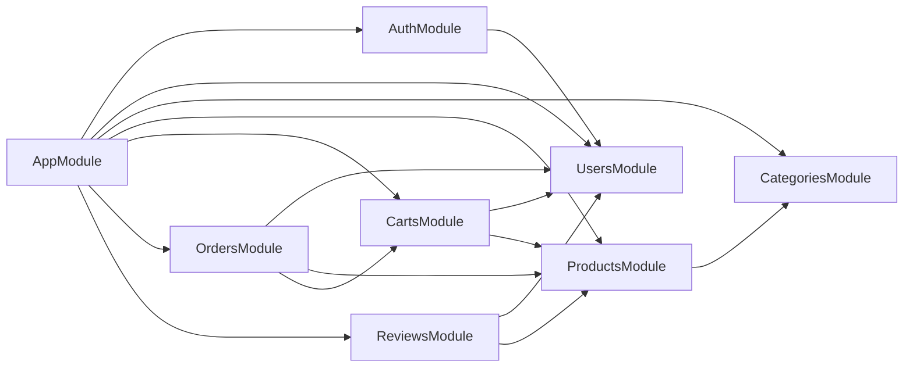

# Quan hệ các module (NestJS)

Mục tiêu: tách module theo nghiệp vụ ecommerce, tránh phụ thuộc vòng (circular), và export đúng provider để module khác có thể inject service khi cần.

## Module graph (Mermaid)

## Ý nghĩa dependency

- `AuthModule` dùng `UsersService` để đăng ký/đăng nhập/đổi mật khẩu → import `UsersModule`.
- `ProductsModule` cần validate `category_id` hoặc lấy danh mục sản phẩm → import `CategoriesModule`.
- `CartsModule` cần xác thực user + kiểm tra tồn kho/giá sản phẩm → import `UsersModule`, `ProductsModule`.
- `OrdersModule` tạo đơn hàng cho user, snapshot giá từ sản phẩm, và (tuỳ flow) checkout từ cart → import `UsersModule`, `ProductsModule`, `CartsModule`.
- `ReviewsModule` cần user + product để tạo review, enforce unique(user, product) → import `UsersModule`, `ProductsModule`.

## Export providers

Các module feature export service để module khác inject:

- `UsersModule` exports `UsersService`
- `CategoriesModule` exports `CategoriesService`
- `ProductsModule` exports `ProductsService`
- `CartsModule` exports `CartsService`
- `OrdersModule` exports `OrdersService`
- `ReviewsModule` exports `ReviewsService`
- `AuthModule` exports `AuthService` (nếu module khác cần verify token/guard tuỳ thiết kế)

